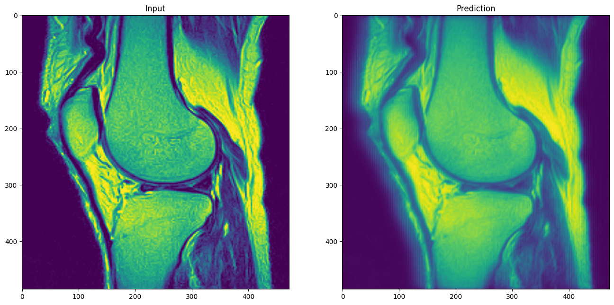
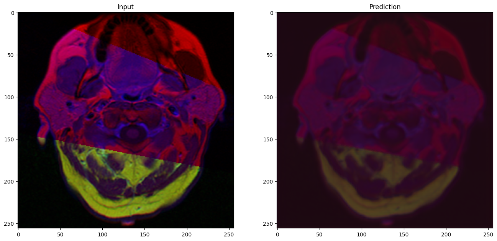
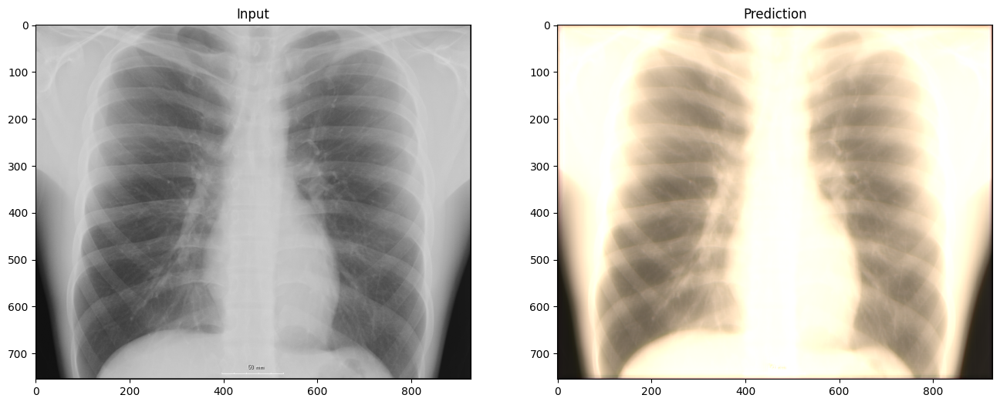
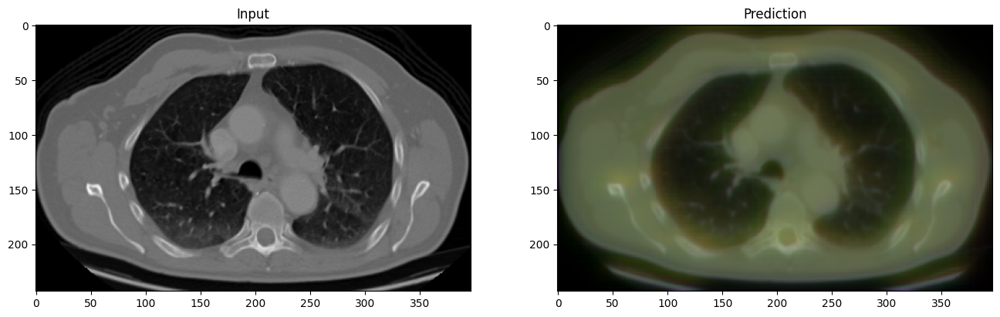

# Denoising Medical Images using Noise2Void

This project employs the Noise2Void (N2V) model for denoising medical images, specifically targeting MRI bone, MRI brain, chest X-ray, and CT scan images. The N2V model is a powerful deep learning approach designed for image restoration tasks, and in this project, we utilize its capabilities to enhance the quality of medical imaging.

## Key Tasks

1. **Data Collection**
   
    Gather a diverse dataset of medical images, including MRI bone, MRI brain, chest X-ray, and CT scan images.

2. **Data Preprocessing**
    
    Prepare the medical images for denoising by handling data-specific nuances, resizing, and normalization.

3. **Noise2Void Model Implementation and Training**
Implement and train the Noise2Void model for denoising medical images using TensorFlow.

## Demo

Here are visual demonstrations showcasing the denoising results for each type of medical image.

### MRI Bone

### MRI Brain

### Chest X-ray

### CT Scan

## Additional Information
For detailed information on the Noise2Void model and its implementation, you can refer to the original paper:

[Noise2Void: Learning Denoising from Single Noisy Images](https://arxiv.org/abs/1811.10980)
